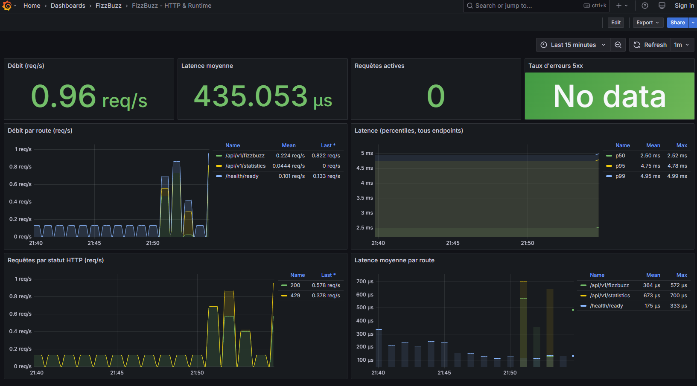
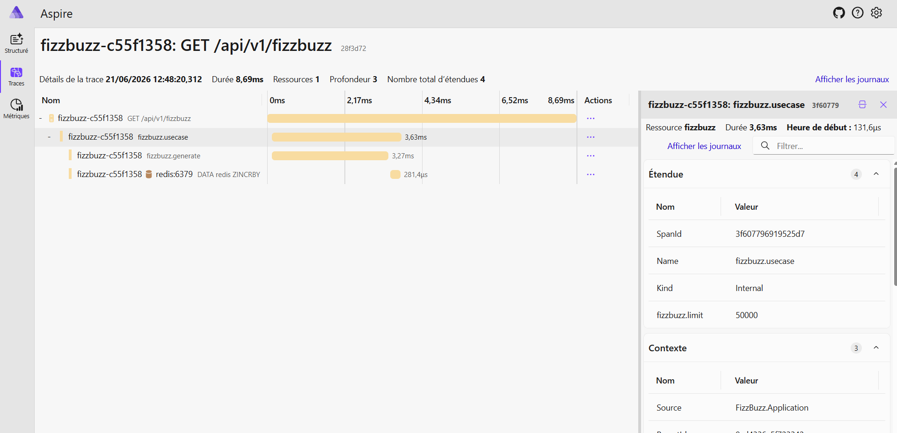
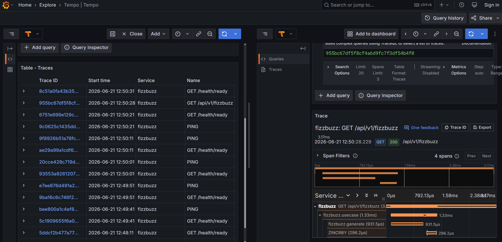

# FizzBuzz API

Web API (.NET 10 / ASP.NET Core) that generates configurable FizzBuzz sequences and
exposes usage statistics. Interactive documentation is available through Swagger.


## Prerequisites

| To... | You need... |
|-------|-------------|
| Run with Docker | [Docker](https://docs.docker.com/get-docker/) (with Docker Compose, included in Docker Desktop) |
| Run locally | The [.NET 10 SDK](https://dotnet.microsoft.com/download/dotnet/10.0) |

## Quick start with Docker (recommended)

No .NET installation required: Docker handles everything.

```bash
# From the project root
docker compose up --build
```

The API is then available at **http://localhost:8080**.

Open the Swagger UI to explore and test the endpoints interactively: **http://localhost:8080/swagger**

To stop it:

```bash
# Ctrl+C if running in the foreground, otherwise:
docker compose down
```

## Running locally (without Docker)

```bash
dotnet run --project FizzBuzz/FizzBuzz.csproj
```

When run locally, the application starts in the `Development` environment (see
`FizzBuzz/Properties/launchSettings.json`) at **http://localhost:5135**
(and https://localhost:7134).

Run the tests:

```bash
dotnet test
```
## Authentication & authorization

The API and Grafana are protected by **[Keycloak](https://www.keycloak.org/)**
(OAuth2 / OpenID Connect). Keycloak runs as part of the Docker Compose stack at
**http://localhost:8081** and **auto-imports** a ready-to-use realm and users on first start
(`keycloak/realm-export.json`), no manual configuration required.

### Single sign-on (one session for Swagger and Grafana)

This is true **SSO**: Keycloak is a single, shared identity provider for the whole realm,
so the **same login session is reused for both the API/Swagger and Grafana**. Sign in once
for example via the Swagger **Authorize** button,  and opening Grafana logs you in
**automatically, without re-entering your credentials** (and the other way around). Each
app still receives its own tokens, what they share is the Keycloak authentication session.

Conversely, the single sign-out wired on Grafana ends that shared session, so after signing
out of Grafana you will be prompted to authenticate again on Swagger too.

### Actors

| Actor | Keycloak client | Flow                                        |
|-------|-----------------|---------------------------------------------|
| Swagger UI | `fizzbuzz-swagger` | Authorization Code                          |
| FizzBuzz API | *(resource server)*  | validates the JWT (issuer, audience, roles) |
| Grafana | `grafana` |  Authorization Code (OIDC SSO)              |

### Roles and protected endpoints

| Realm role | Grants |
|------------|--------|
| `fizzbuzz.user` | `GET /api/v1/fizzbuzz` |
| `fizzbuzz.admin` | `GET /api/v1/fizzbuzz` **and** `GET /api/v1/statistics` |

`/health/*` (probes) and `/swagger` + `/openapi/v1.json` (so you can log in) stay
**public**. Everything under `/api/v1` requires a valid token with the right role.

### Test users

| Username | Password | Roles |
|----------|----------|-------|
| `admin_user` | `admin_user` | `fizzbuzz.user`, `fizzbuzz.admin` |
| `user` | `user` | `fizzbuzz.user` |

### Logging in through Swagger

1. Open the Swagger UI: **http://localhost:8080/swagger**
2. Click **Authorize**, then sign in to Keycloak (e.g. as `admin_user`).
3. Requests now carry the bearer token. As `user`, `GET /api/v1/statistics` returns
   **403 Forbidden** (no `fizzbuzz.admin` role); as `admin_user` it returns **200**.

### Logging in to Grafana

Open **http://localhost:3000** → you are redirected to Keycloak → sign in. Only the
**`fizzbuzz.admin`** role grants real access (mapped to Grafana **Admin**). Everyone
else (e.g. `user`, who only has `fizzbuzz.user`) is mapped to Grafana's built-in
**`None`** role: they are signed in but see **no dashboards**. They are *not* hard-denied
on purpose, keeping a session means the **Sign out** button stays available to them
(which then triggers the single sign-out below). So `admin_user` gets full access, while
`user` can sign in, sees nothing, and can still sign out cleanly.

**Logout (single sign-out).** Signing out of Grafana also terminates the Keycloak SSO
session (RP-initiated logout via `GF_AUTH_SIGNOUT_REDIRECT_URL` → Keycloak's
`end_session_endpoint`), so the next sign-in prompts for credentials again
instead of logging back in silently. The `grafana` client registers
`http://localhost:3000/*` as a valid post-logout redirect URI for this.

### Secrets

`.env` (git-ignored) holds the Keycloak admin credentials and the Grafana OAuth client
secret; see `.env.example`. The Grafana client secret must match the one in
`keycloak/realm-export.json` (the committed value is a **dev-only** placeholder).

## Docker details

The [`Dockerfile`](Dockerfile) uses a **multi-stage build**:

1. **`build` stage** : .NET 10 SDK image (heavy): restores the NuGet dependencies, then
   publishes the application in `Release` configuration. The restore is done in a separate
   layer (the `.csproj` is copied before the rest of the code) to take advantage of
   Docker's layer cache: packages are re-downloaded only when the `.csproj` changes.
2. **`final` stage** : ASP.NET runtime image (lightweight): copies only the published
   binaries. The shipped image contains neither the SDK nor the source code → smaller and
   more secure.

Network configuration:

- Kestrel listens on port **8080** inside the container (`ASPNETCORE_HTTP_PORTS`).
- The [`docker-compose.yml`](docker-compose.yml) publishes that port on `8080` of the host
  machine (`ports: "8080:8080"`).

## Rate limiting

The API is protected by ASP.NET Core's built-in rate limiter. Each
client is identified by its **IP address**, and requests beyond the allowance get a
`429 Too Many Requests`.

| Scope | Limit | Applies to |
|-------|-------|------------|
| Global (fallback) | **100 requests / minute per IP** | Every endpoint, including `/api/v1/statistics` |
| `fizzbuzz` policy | **20 requests / minute per IP** | `GET /api/v1/fizzbuzz` only |

The stricter policy targets `/fizzbuzz` because it is the expensive endpoint: a single call can
generate up to 50&nbsp;000 entries **and** write to Redis. The global limiter is a safety net for
everything else.

Both use a **fixed window** algorithm: the allowance resets at the start of each one-minute window.
Health check endpoints (`/health/*`) are **exempt** — `UseRateLimiter()` is wired *after* the
health endpoints so orchestrator probes are never throttled.

The configuration lives in [`FizzBuzz/RateLimiting.cs`](FizzBuzz/RateLimiting.cs); the `fizzbuzz`
policy is attached to the endpoint via `.RequireRateLimiting(...)`.

> **Note: single instance only.** The limiter counts requests **in memory, per process**. If the
> API is scaled to several replicas, each one keeps its own counters, so the effective limit is
> multiplied by the number of instances. A distributed setup would handle rate limiting at the
> **infrastructure / gateway level** (API gateway, ingress, reverse proxy...), where a
> single component sees all traffic before it reaches any replica.

## Health checks

The API exposes two health endpoints, following the standard **liveness / readiness** split:

| Endpoint | Question it answers | Checks Redis? | Status codes |
|----------|---------------------|---------------|--------------|
| `GET /health/live` | Is the process running and responsive? | No | `200 Healthy` |
| `GET /health/ready` | Can the app actually serve traffic (Redis reachable)? | Yes | `200 Healthy` / `503 Unhealthy` |

The split lets an orchestrator (like kubernetes) react appropriately: a failing **liveness** probe means *restart the
container*, while a failing **readiness** probe means *keep the container but stop routing traffic to
it* until its dependencies recover.

### How it works: background polling + cache

The health check is **not** evaluated when an endpoint is called. Instead it runs **in the background
every 10 seconds**, and the endpoints return the last cached result. This keeps the endpoints
instantaneous (~1 ms) and bounds the load on Redis regardless of how often the probes are called.

A consequence of background polling: a change in Redis availability takes **up to 10 s** to be
reflected by the endpoints. Lower `Period` for faster detection at the cost of more frequent pings.

### Docker / Compose probe

[`docker-compose.yml`](docker-compose.yml) defines a container health check that calls
`/health/ready` (using `curl`, installed in the runtime image for this purpose):

```yaml
healthcheck:
  test: ["CMD", "curl", "-f", "http://localhost:8080/health/ready"]
  interval: 10s
  timeout: 3s
  retries: 3
  start_period: 10s
```

## Observability

The API is fully instrumented with **[OpenTelemetry](https://opentelemetry.io/)** and emits the
three signals **logs, traces and metrics** over a single **OTLP** stream. Because the app only
ever talks OTLP, the visualization backend is interchangeable: nothing in the code changes whether
the data ends up in Aspire, Grafana, or anything else.

### Architecture: one stream in, fan-out

The application sends a **single** OTLP stream to a central **OpenTelemetry Collector**, which then
**fans the data out** to every backend. The app has just one endpoint to configure
(`OpenTelemetry__OtlpEndpoint`), and adding/removing a backend is a Collector-only change.


| Signal | Routed to |
|--------|-----------|
| Traces | Aspire **+** Tempo |
| Metrics | Aspire **+** Prometheus |
| Logs | Aspire **+** Loki |

The Collector configuration lives in
[`observability/otel-collector-config.yaml`](observability/otel-collector-config.yaml); each backend
has its own config under [`observability/`](observability/).

### Two UIs: Aspire (dev) vs Grafana (prod-like)

| | [Aspire Dashboard](http://localhost:18888) | [Grafana](http://localhost:3000) |
|--|--|--|
| **Purpose** | **Local development.** Zero-config, all three signals in one .NET-native UI. | **Representation of what runs in production**: the Grafana + Tempo/Loki/Prometheus stack. |
| **Backing store** | In-memory (data is lost on restart) | Persistent backends (Tempo, Loki, Prometheus) |
| **Use it to...** | Quickly inspect a request while coding | Build dashboards, query history, mimic the prod setup |

Both are fed by the same Collector, so a given request shows up in **both** UIs simultaneously.

> Grafana's datasources (Prometheus, Tempo, Loki) and the dashboard below are **provisioned
> automatically** from [`observability/grafana/provisioning/`](observability/grafana/provisioning/) nothing to click on first launch.

### What is instrumented

- **Automatic** (via OpenTelemetry instrumentation libraries):
  - Incoming HTTP requests: duration, status, route
  - Outgoing HTTP calls
  - **Redis** commands
  - .NET runtime metrics (GC, threads, allocations)
- **Logs**: the existing Serilog pipeline keeps writing to the console **and** exports to OTLP via
  the `Serilog.Sinks.OpenTelemetry` sink, log entries are correlated to the trace that produced them.
- **Custom spans**: [`FizzBuzzUseCase`](FizzBuzz/Application/FizzBuzzUseCase.cs) emits its own spans
  through a dedicated [`ActivitySource`](FizzBuzz/Application/AppDiagnostics.cs):
  - `fizzbuzz.usecase` the whole use case (sequence computation + redis)
  - `fizzbuzz.generate`  **the sequence computation only**

  This makes it obvious where time goes on a `GET /api/v1/fizzbuzz`: the width of `fizzbuzz.generate`
  (pure CPU) vs. the Redis span (I/O) vs. the rest of the HTTP span (serialization, middleware):

### Metrics dashboard

A ready-made **"FizzBuzz – HTTP & Runtime"** dashboard (request rate, average latency, p95/p99,
error rate, active requests) is provisioned in Grafana. Open
[Grafana](http://localhost:3000) -> *Dashboards* -> folder *FizzBuzz*.



### Traces

The same trace is visible in both tools. In **Aspire** (local development):



And in **Grafana** via Tempo:



### URLs

| Service | URL | Notes |
|---------|-----|-------|
| Swagger UI | http://localhost:8080/swagger | Authenticated via Keycloak (see [Authentication & authorization](#authentication--authorization)) |
| **Aspire Dashboard** | http://localhost:18888 | Logs + traces + metrics, dev |
| **Grafana** | http://localhost:3000 | SSO via Keycloak, dashboards provisioned |
| **Keycloak** | http://localhost:8081 | Identity provider (admin console at `/admin`) |

Prometheus, Tempo and Loki are **internal** to the Compose network (not published to the host); you
reach them through Grafana's *Explore* view.
